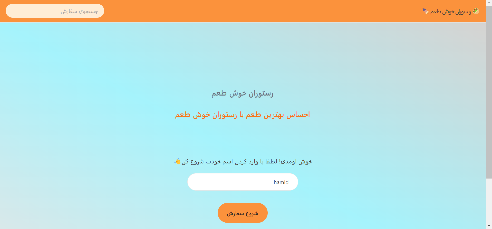
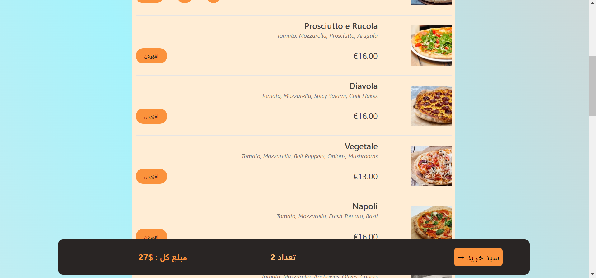
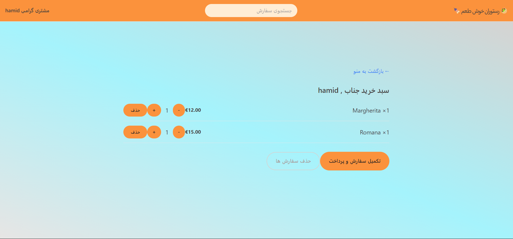
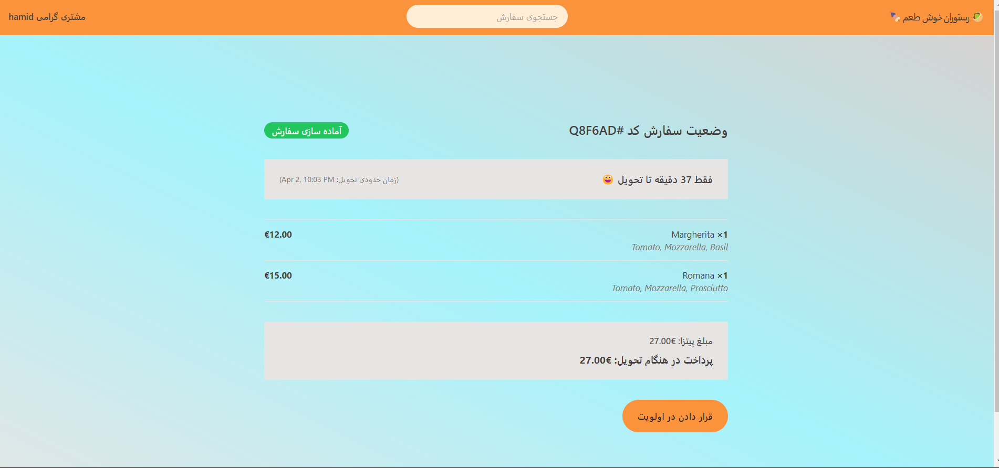

# Khosh taam Restaurant

## Project online demo

click & show👉👉[live demo link](https://hamid-restaurant.vercel.app)👈👈

## images

## Overview

Welcome to the Khosh taam Restaurant Project, a dynamic web application built with React.js, React Router, Redux, API integration for data retrieval, and styled using Tailwind CSS.

**Note: This is a practice project.**

The Restaurant Project is a modern web application designed to showcase a restaurant's menu, provide information about the restaurant, and allow users to explore various sections seamlessly. Key features include React Router for navigation, Redux for state management, API integration for reading data from a backend, and Tailwind CSS for a responsive and visually appealing design.

## Key Features

- **React Components Structure:** Modular components for different sections like Menu, About Us, Contact, etc.
- **React Router Navigation:** Smooth navigation without full page reloads.
- **State Management with Redux:** Centralized state for features like data fetched from the backend.
- **API Integration (Reading Data):** Connection to a backend API for retrieving dynamic data.
- **Responsive Design with Tailwind CSS:** Modern and responsive UI using the Tailwind CSS framework.

## Technology Stack

- **React.js:** Frontend framework for building user interfaces.
- **Redux:** State management library for managing global application state.
- **React Router:** Facilitates navigation within the application.
- **REST API:** Used for making HTTP requests to connect with the backend API and retrieve data.
- **Tailwind CSS:** Styling framework for building modern and responsive UIs.
- **Backend API :** Provides read-only data for the frontend.
